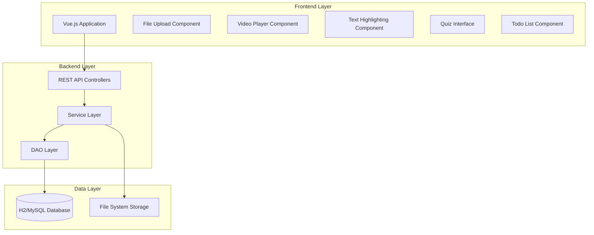

# Design Document: English Learning System

## Overview

The English Learning System is a web-based application designed to help IELTS students manage their study materials and practice vocabulary through spaced repetition. The system consists of a Spring Boot backend following the established project structure guidelines and a Vue.js frontend providing an intuitive user interface.

The core workflow involves users uploading study materials (documents, videos, articles), highlighting unfamiliar vocabulary with personal annotations, and then being quizzed on this vocabulary using scientifically-backed spaced repetition algorithms. The system automatically schedules review sessions and maintains a todo list to keep users organized.

## Architecture

### System Architecture

The system follows a layered architecture pattern with clear separation of concerns:



### Technology Stack

**Backend:**
- Spring Boot 3.x with Java 17+
- Spring Data JPA for database operations
- Spring Web for REST API endpoints
- H2 Database (development) / MySQL (production)
- File system storage for uploaded materials

**Frontend:**
- Vue.js 3 with Composition API
- Vue Router for navigation
- Axios for HTTP requests
- Video.js for video playback
- Quill.js or similar for text highlighting

## Components and Interfaces

### Backend Components

Following the established project structure, the backend will be organized as:

#### API Layer (`api/` package)
```java
// Study material management
public interface StudyMaterialApi {
    ResponseEntity<StudyMaterialResultDto> uploadMaterial(MultipartFile file, String title, String type);
    ResponseEntity<List<StudyMaterialResultDto>> getAllMaterials();
    ResponseEntity<StudyMaterialResultDto> getMaterial(Long id);
}

// Vocabulary highlighting and management
public interface VocabularyApi {
    ResponseEntity<HighlightResultDto> createHighlight(HighlightParamsDto params);
    ResponseEntity<List<HighlightResultDto>> getHighlightsByMaterial(Long materialId);
    ResponseEntity<HighlightResultDto> updateHighlight(Long id, HighlightParamsDto params);
}

// Review and quiz system
public interface ReviewApi {
    ResponseEntity<ReviewSessionResultDto> startReviewSession();
    ResponseEntity<QuestionResultDto> getNextQuestion(Long sessionId);
    ResponseEntity<Void> submitAnswer(Long sessionId, AnswerParamsDto answer);
    ResponseEntity<ReviewSessionResultDto> completeSession(Long sessionId);
}

// Todo list and scheduling
public interface TodoApi {
    ResponseEntity<List<TodoItemResultDto>> getTodoItems();
    ResponseEntity<TodoItemResultDto> createTodoItem(TodoItemParamsDto params);
    ResponseEntity<Void> completeTodoItem(Long id);
}
```

#### Service Layer (`service/` package)
```java
public interface StudyMaterialService {
    StudyMaterial uploadMaterial(MultipartFile file, String title, MaterialType type);
    List<StudyMaterial> getAllMaterials();
    StudyMaterial getMaterialById(Long id);
}

public interface VocabularyService {
    Highlight createHighlight(Long materialId, String text, String context, Integer startPos, Integer endPos);
    List<Highlight> getHighlightsByMaterial(Long materialId);
    Highlight updateHighlight(Long id, String comment);
}

public interface SpacedRepetitionService {
    ReviewSession createReviewSession();
    Question getNextQuestion(Long sessionId);
    void processAnswer(Long sessionId, Long highlightId, AnswerQuality quality);
    void completeSession(Long sessionId);
    LocalDate calculateNextReviewDate(Highlight highlight, AnswerQuality quality);
}

public interface TodoService {
    List<TodoItem> getTodoItems();
    TodoItem createTodoItem(String title, String description, LocalDate dueDate);
    void completeTodoItem(Long id);
    void scheduleReviewReminder(Highlight highlight, LocalDate reviewDate);
}
```

#### Data Access Layer (`dao/jpa/` package)
```java
public interface StudyMaterialRepository extends JpaRepository<StudyMaterial, Long> {
    List<StudyMaterial> findByTypeOrderByCreatedDateDesc(MaterialType type);
}

public interface HighlightRepository extends JpaRepository<Highlight, Long> {
    List<Highlight> findByMaterialIdOrderByPositionAsc(Long materialId);
    List<Highlight> findByNextReviewDateLessThanEqual(LocalDate date);
}

public interface ReviewSessionRepository extends JpaRepository<ReviewSession, Long> {
    List<ReviewSession> findByCompletedFalse();
}

public interface TodoItemRepository extends JpaRepository<TodoItem, Long> {
    List<TodoItem> findByCompletedFalseOrderByDueDateAsc();
}
```

### Frontend Components

#### Core Vue Components
```javascript
// Main application layout
const AppLayout = {
  components: {
    NavigationBar,
    MainContent,
    NotificationPanel
  }
}

// Study material management
const MaterialManager = {
  components: {
    FileUploadComponent,
    MaterialList,
    MaterialViewer
  }
}

// Text highlighting interface
const HighlightEditor = {
  props: ['content', 'highlights'],
  emits: ['highlight-created', 'highlight-updated']
}

// Video player with highlighting support
const VideoPlayerComponent = {
  components: {
    VideoPlayer,
    TranscriptViewer,
    HighlightOverlay
  }
}

// Quiz and review system
const ReviewInterface = {
  components: {
    QuestionCard,
    AnswerButtons,
    ProgressIndicator
  }
}

// Todo list and scheduling
const TodoListComponent = {
  components: {
    TodoItem,
    AddTodoForm,
    FilterControls
  }
}
```

## Data Models

### Core Entities

#### StudyMaterial Entity
```java
@Entity
@Table(name = "study_materials")
public class StudyMaterial extends BaseEntity {
    @Id
    @GeneratedValue(strategy = GenerationType.IDENTITY)
    private Long id;
    
    @Column(nullable = false)
    private String title;
    
    @Column(nullable = false)
    private String fileName;
    
    @Column(nullable = false)
    private String filePath;
    
    @Enumerated(EnumType.STRING)
    private MaterialType type; // DOCUMENT, VIDEO, ARTICLE
    
    @Column
    private String mimeType;
    
    @Column
    private Long fileSize;
    
    @OneToMany(mappedBy = "material", cascade = CascadeType.ALL)
    private List<Highlight> highlights = new ArrayList<>();
}
```

#### Highlight Entity
```java
@Entity
@Table(name = "highlights")
public class Highlight extends BaseEntity {
    @Id
    @GeneratedValue(strategy = GenerationType.IDENTITY)
    private Long id;
    
    @ManyToOne(fetch = FetchType.LAZY)
    @JoinColumn(name = "material_id", nullable = false)
    private StudyMaterial material;
    
    @Column(nullable = false, length = 1000)
    private String text;
    
    @Column(length = 2000)
    private String context;
    
    @Column
    private Integer startPosition;
    
    @Column
    private Integer endPosition;
    
    @Column(length = 2000)
    private String userComment;
    
    // Spaced repetition fields
    @Column(nullable = false)
    private Double easeFactor = 2.5;
    
    @Column(nullable = false)
    private Integer repetitionCount = 0;
    
    @Column(nullable = false)
    private Integer intervalDays = 1;
    
    @Column
    private LocalDate nextReviewDate;
    
    @Column
    private LocalDate lastReviewDate;
    
    @OneToMany(mappedBy = "highlight", cascade = CascadeType.ALL)
    private List<ReviewRecord> reviewHistory = new ArrayList<>();
}
```

#### ReviewSession Entity
```java
@Entity
@Table(name = "review_sessions")
public class ReviewSession extends BaseEntity {
    @Id
    @GeneratedValue(strategy = GenerationType.IDENTITY)
    private Long id;
    
    @Column(nullable = false)
    private LocalDateTime startTime;
    
    @Column
    private LocalDateTime endTime;
    
    @Column(nullable = false)
    private Boolean completed = false;
    
    @Column
    private Integer totalQuestions = 0;
    
    @Column
    private Integer correctAnswers = 0;
    
    @OneToMany(mappedBy = "session", cascade = CascadeType.ALL)
    private List<ReviewRecord> reviewRecords = new ArrayList<>();
}
```

#### ReviewRecord Entity
```java
@Entity
@Table(name = "review_records")
public class ReviewRecord extends BaseEntity {
    @Id
    @GeneratedValue(strategy = GenerationType.IDENTITY)
    private Long id;
    
    @ManyToOne(fetch = FetchType.LAZY)
    @JoinColumn(name = "session_id", nullable = false)
    private ReviewSession session;
    
    @ManyToOne(fetch = FetchType.LAZY)
    @JoinColumn(name = "highlight_id", nullable = false)
    private Highlight highlight;
    
    @Enumerated(EnumType.STRING)
    private AnswerQuality quality; // PERFECT, CORRECT, DIFFICULT, INCORRECT, BLACKOUT
    
    @Column(nullable = false)
    private LocalDateTime reviewTime;
    
    @Column
    private Integer responseTimeSeconds;
}
```

#### TodoItem Entity
```java
@Entity
@Table(name = "todo_items")
public class TodoItem extends BaseEntity {
    @Id
    @GeneratedValue(strategy = GenerationType.IDENTITY)
    private Long id;
    
    @Column(nullable = false)
    private String title;
    
    @Column(length = 1000)
    private String description;
    
    @Column
    private LocalDate dueDate;
    
    @Column(nullable = false)
    private Boolean completed = false;
    
    @Enumerated(EnumType.STRING)
    private TodoType type; // REVIEW_SESSION, CUSTOM_TASK
    
    @ManyToOne(fetch = FetchType.LAZY)
    @JoinColumn(name = "related_highlight_id")
    private Highlight relatedHighlight;
}
```

### Enumerations

```java
public enum MaterialType {
    DOCUMENT, VIDEO, ARTICLE
}

public enum AnswerQuality {
    PERFECT(5),     // Perfect response
    CORRECT(4),     // Correct after hesitation
    DIFFICULT(3),   // Correct with serious difficulty
    INCORRECT(2),   // Incorrect but seemed easy
    REMEMBERED(1),  // Incorrect but remembered
    BLACKOUT(0);    // Complete blackout
    
    private final int value;
}

public enum TodoType {
    REVIEW_SESSION, CUSTOM_TASK
}
```

## Correctness Properties

*A property is a characteristic or behavior that should hold true across all valid executions of a system—essentially, a formal statement about what the system should do. Properties serve as the bridge between human-readable specifications and machine-verifiable correctness guarantees.*

Based on the requirements analysis, the following correctness properties must be validated through property-based testing:

### Property 1: File Upload and Storage Consistency
*For any* valid file (document or video), uploading it to the system should result in the file being stored and accessible for future retrieval with all metadata preserved.
**Validates: Requirements 1.1, 1.2**

### Property 2: Material Listing Completeness
*For any* set of uploaded materials, viewing the materials list should display all uploaded items in the correct chronological order.
**Validates: Requirements 1.3**

### Property 3: Material Access Functionality
*For any* uploaded study material, selecting it should open the material for viewing and enable highlighting functionality.
**Validates: Requirements 1.4**

### Property 4: Highlight Creation and Storage
*For any* text selection within a document, creating a highlight should store the selected text with its context and make it available for future access.
**Validates: Requirements 2.1, 2.2**

### Property 5: Comment Association and Display
*For any* highlight with an associated comment, viewing the highlight should display the comment both in normal view and during review sessions.
**Validates: Requirements 2.3, 2.4, 3.5**

### Property 6: Data Persistence Across Sessions
*For any* highlights and comments created in the system, they should remain accessible after system restart or session termination.
**Validates: Requirements 2.5**

### Property 7: Review Session Question Presentation
*For any* review session, highlights should be presented one at a time with the correct word/phrase and context information displayed.
**Validates: Requirements 3.1, 3.2**

### Property 8: Answer Recording and Processing
*For any* answer submitted during a review session, the system should record the user's self-assessment and use it for spaced repetition calculations.
**Validates: Requirements 3.3, 3.4**

### Property 9: Spaced Repetition Algorithm Correctness
*For any* completed review with a given answer quality, the next review date should be calculated according to the SM-2 algorithm rules, with intervals increasing for correct answers and decreasing for incorrect answers.
**Validates: Requirements 4.1, 4.3, 4.4**

### Property 10: Five-Day Reminder Scheduling
*For any* newly created highlight, a review reminder should be automatically scheduled exactly 5 days after the initial learning session.
**Validates: Requirements 4.5**

### Property 11: Todo List Synchronization
*For any* scheduled review session, it should automatically appear in the todo list, and completing the review should mark the corresponding todo item as complete.
**Validates: Requirements 4.2, 5.1, 5.2**

### Property 12: Todo List Display Accuracy
*For any* pending review sessions and custom tasks, the todo list should display all items with correct due dates in chronological order.
**Validates: Requirements 5.3, 5.4**

### Property 13: Notification System Behavior
*For any* due or overdue review sessions, appropriate notifications should be sent to the user, with multiple due reviews batched together appropriately.
**Validates: Requirements 6.1, 6.2, 6.4**

### Property 14: Notification Configuration Persistence
*For any* notification preference changes made by the user, the settings should be saved and applied to future notifications.
**Validates: Requirements 6.3**

### Property 15: Interface Responsiveness and Navigation
*For any* device type (desktop or mobile), the Vue.js interface should be responsive and provide functional navigation between all system sections.
**Validates: Requirements 7.1, 7.3, 7.5**

### Property 16: Video Handling and Playback
*For any* supported video format (MP4, AVI, MOV), the system should either provide embedded playback or gracefully handle the file for external playback.
**Validates: Requirements 8.1, 8.4, 8.5**

### Property 17: Video Transcript Highlighting
*For any* video with an available transcript, highlighting text within the transcript should create a highlight linked to the specific video timestamp.
**Validates: Requirements 8.2, 8.3**

## Error Handling

### File Upload Error Handling
- **Invalid file types**: Return clear error messages for unsupported file formats
- **File size limits**: Enforce maximum file size limits and provide user feedback
- **Storage failures**: Handle disk space issues and provide graceful degradation
- **Corrupted files**: Detect and reject corrupted or malformed files

### Database Error Handling
- **Connection failures**: Implement retry logic and connection pooling
- **Constraint violations**: Handle unique constraint violations gracefully
- **Transaction failures**: Implement proper rollback mechanisms
- **Data integrity**: Validate data before persistence operations

### Spaced Repetition Error Handling
- **Invalid date calculations**: Handle edge cases in date arithmetic
- **Missing review data**: Provide default values for incomplete review records
- **Algorithm failures**: Fallback to simple interval calculations if complex algorithms fail

### Frontend Error Handling
- **Network failures**: Implement retry mechanisms and offline indicators
- **Invalid user input**: Provide real-time validation and clear error messages
- **Component failures**: Implement error boundaries to prevent cascade failures
- **Browser compatibility**: Graceful degradation for unsupported features

## Testing Strategy

### Dual Testing Approach

The system will employ both unit testing and property-based testing to ensure comprehensive coverage:

**Unit Tests:**
- Verify specific examples and edge cases
- Test integration points between components
- Validate error conditions and boundary cases
- Focus on concrete scenarios and known inputs

**Property-Based Tests:**
- Verify universal properties across all inputs
- Use randomized input generation for comprehensive coverage
- Validate correctness properties from the design document
- Run minimum 100 iterations per property test

### Property-Based Testing Configuration

**Testing Framework:** We will use **QuickCheck for Java** (or **jqwik**) for property-based testing in the Spring Boot backend.

**Test Configuration:**
- Minimum 100 iterations per property test
- Each property test must reference its design document property
- Tag format: **Feature: english-learning-system, Property {number}: {property_text}**

**Example Property Test Structure:**
```java
@Property
@Label("Feature: english-learning-system, Property 1: File Upload and Storage Consistency")
void fileUploadStorageConsistency(@ForAll("validFiles") MultipartFile file) {
    // Upload file
    StudyMaterial uploaded = studyMaterialService.uploadMaterial(file, "test", MaterialType.DOCUMENT);
    
    // Verify storage and retrieval
    StudyMaterial retrieved = studyMaterialService.getMaterialById(uploaded.getId());
    
    assertThat(retrieved).isNotNull();
    assertThat(retrieved.getFileName()).isEqualTo(file.getOriginalFilename());
    assertThat(retrieved.getFileSize()).isEqualTo(file.getSize());
}
```

### Unit Testing Balance

Unit tests complement property-based tests by focusing on:
- Specific examples that demonstrate correct behavior
- Integration testing between Spring Boot layers
- Edge cases like empty inputs, boundary values, and error conditions
- Validation of the spaced repetition algorithm with known inputs

Property-based tests handle comprehensive input coverage through randomization, while unit tests ensure specific scenarios work correctly.

### Test Data Generation

**Smart Generators:**
- File generators that create valid documents and videos within size limits
- Text generators that produce realistic vocabulary with context
- Date generators that respect business rules and constraints
- User input generators that simulate realistic interaction patterns

**Constraint-Based Generation:**
- Highlight generators that respect document boundaries
- Review session generators that maintain consistency
- Spaced repetition generators that follow algorithm rules